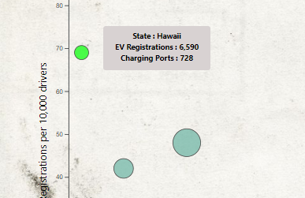
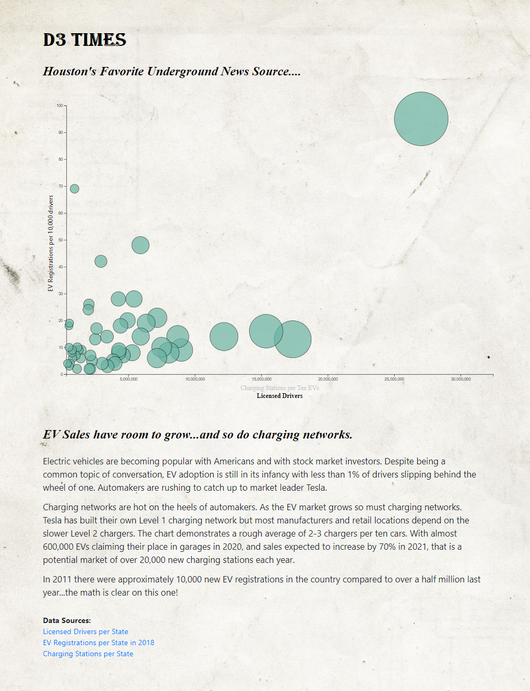

<html>

            
<body>

The project pulls together three datasets to provide an interactive visual display of the key datapoints.

The bubble chart is dynamically created based upon an [EV Dataset](assets/data/EVs.csv)- using JavaScript, HTML, and CSS, and D3.js.  The chart is responsive to screen size. Detailed data (State name, number of EV registrations, and the number of Charge Ports) on a bubble is obtained by hovering over the bubble- the user verifies which bubble has been selected by its transition to a lime green color.  The decision was made to not statically label each bubble because of the overlapping bubbles for some data points.: <a href="https://danawoodruff.github.io/d3-challenge/">View GitHub-Page.</a>  The opacity of the bubbles allow the user to select, and verify their selection, of bubbles that are overlapped.

The chart initially loads visualizing EV Registrations per 10,000 drivers versus Charge Ports per 10 EVs but the user has the option to select an alternate x-axis by clicking "Licensed Drivers" to alter chart view to EV Registrations per 10,000 drivers versus licensed drivers.

The first view offers information on where an investor might install new public charging stations while the second offers information on which states have high EV registration numbers for its population of licensed drivers.

Users can view the original data sources via live links at the bottom of the page.

To view the JavaScript code: [JavaScript Code](assets/js/app.js) 
To view the HTML code: [HTML Code](index.html) 
To view the CSS code: [CSS code](assets/css/style.css) 
To view the D3 CSS code: [D3 CSS code](assets/css/d3Style.css)

 

</body>
</html>
