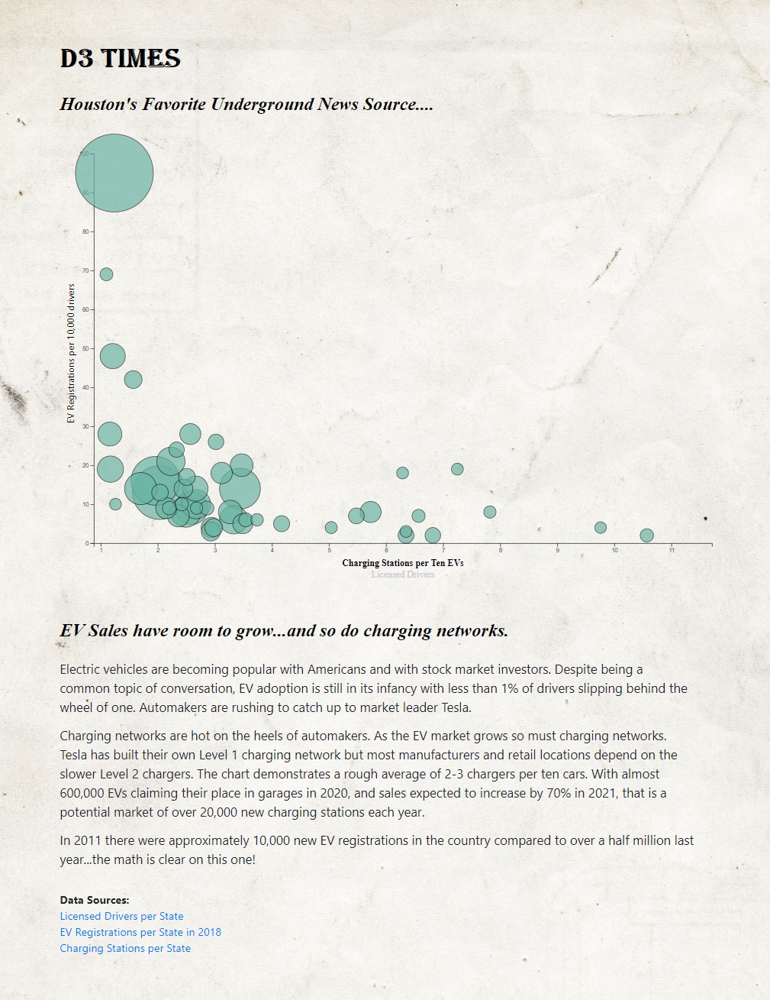

<html>

             
<body>

Describe project here

Chart dynamically created based upon an [EV Dataset](assets/data/EVs.csv)- using JavaScript, HTML, and CSS, and D3.js.  The chart is responsive to screen size. Detailed data on a bubble is obtained by hovering over the bubble- the user verifies which bubble has been selected by its transition to lime green.  The decision was made to not statically label each bubble because of overlapping bubbles.: <a href="https://danawoodruff.github.io/d3-challenge/">View GitHub-Page</a> 

To view the JavaScript code: [JavaScript Code](assets/js/app.js) 
To view the HTML code: [HTML Code](index.html)
 

</body>
</html>
